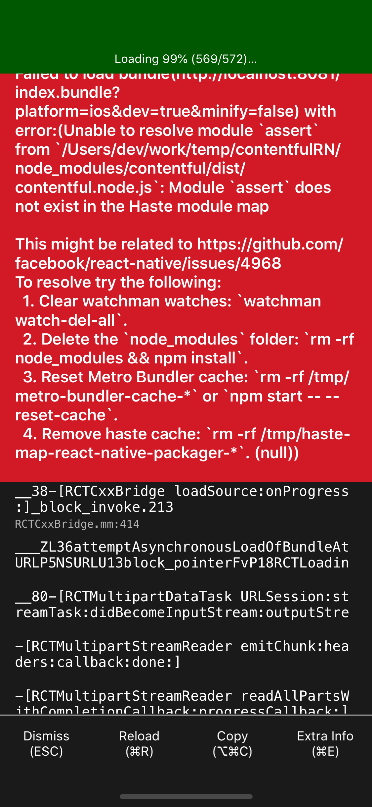
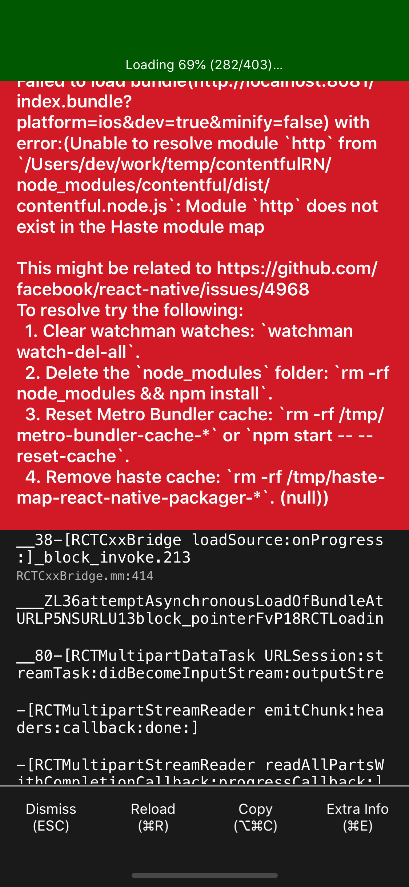

This repo has been created for regenerating contentfuljs issue with react-native


Repo has two branch

## master
which has latest version of contentful(v7.6.0). Which is no more working with react-native it has some build time issue

## working
which has working version of contentful(v3.6.4) which is working with react-native without any issue.


Project has no specific code implementation regarding contentful. In the project I had included just 
```
import contentful from "contentful"
```

just importing breaks react-native project with latest version of contenful.


## ISSUE CODE IN MASTER BRNACH:
When we install contentful in project and just importing in project it is stop building react-native project.
Issue showing with `assert` after installing assert it again show error with http package which i am not able to resolve.
 

